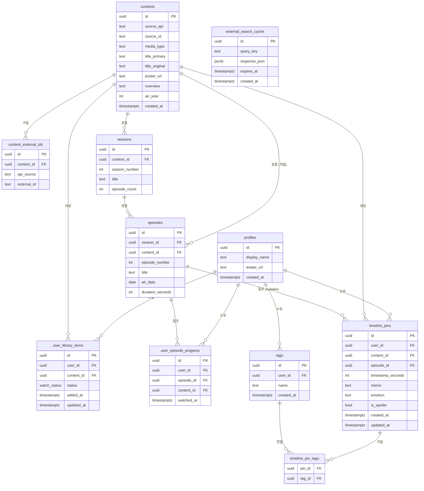

# SceneNote — 아키텍처 설계 문서

**버전:** 1.0.0
**작성일:** 2026-05-02
**작성자:** Mobile App Architect
**상태:** 확정 (MVP 기준)
**기반 문서:** 01_product_requirements.md, 02_user_stories.md, 03_screen_flow.md, 09_timeline_pin_ux.md

---

## 1. 시스템 아키텍처 개요

### 1.1 레이어 구조

```
┌─────────────────────────────────────────────────────────────────┐
│                    Expo App (React Native)                       │
│  ┌──────────────┐  ┌──────────────┐  ┌──────────────────────┐  │
│  │ TanStack     │  │  Zustand /   │  │  React Hook Form     │  │
│  │ Query v5     │  │  Jotai       │  │  + Zod               │  │
│  │ (서버 상태)   │  │  (UI 상태)   │  │  (폼 / 유효성)       │  │
│  └──────┬───────┘  └──────────────┘  └──────────────────────┘  │
└─────────┼───────────────────────────────────────────────────────┘
          │ HTTPS / Supabase SDK
┌─────────▼───────────────────────────────────────────────────────┐
│                     Supabase Platform                           │
│  ┌─────────────┐  ┌─────────────────────┐  ┌───────────────┐  │
│  │ Supabase    │  │  Supabase           │  │  Supabase     │  │
│  │ Auth        │  │  PostgreSQL + RLS    │  │  Edge         │  │
│  │ (JWT 발급)   │  │  (사용자 데이터)     │  │  Functions    │  │
│  └─────────────┘  └──────────┬──────────┘  └───────┬───────┘  │
└─────────────────────────────┼─────────────────────┼────────────┘
                               │                     │ Deno Runtime
                               │             ┌───────▼────────────────┐
                               │             │   External Content APIs │
                               │             │  ┌────────┐ ┌────────┐ │
                               │             │  │  TMDB  │ │AniList │ │
                               │             │  └────────┘ └────────┘ │
                               │             │  ┌────────┐ ┌────────┐ │
                               │             │  │  Kitsu │ │TVmaze  │ │
                               │             │  └────────┘ └────────┘ │
                               │             └────────────────────────┘
                               │ 메타데이터 저장 (라이브러리 추가 시)
                    ┌──────────▼──────────────────────────────┐
                    │  contents / seasons / episodes 테이블    │
                    │  (외부 API 메타데이터 — 선택 저장)        │
                    └─────────────────────────────────────────┘
```

### 1.2 각 레이어의 역할과 책임 범위

| 레이어 | 역할 | 책임 범위 | 금지 사항 |
|--------|------|-----------|-----------|
| **Expo App** | 사용자 인터페이스, 상태 관리, 네비게이션 | UI 렌더링, 로컬 폼 유효성 검사, TanStack Query 캐시 관리 | 외부 API 직접 호출, 외부 API 키 보유 |
| **Supabase Auth** | 사용자 인증 및 JWT 발급 | 이메일/소셜 로그인, 세션 관리, JWT refresh | 사용자 데이터 직접 조회 |
| **Supabase PostgreSQL + RLS** | 사용자 기록 데이터 영구 저장 | 핀, 라이브러리, 에피소드 진행률, 콘텐츠 메타데이터 저장 | RLS 없는 사용자 데이터 테이블 허용 불가 |
| **Supabase Edge Functions** | 외부 API 호출 중계, 콘텐츠 메타데이터 쓰기 | 외부 API 키 보호, 검색 결과 집계, contents 테이블 upsert | 사용자 데이터 직접 조작 (RLS 우회) |
| **External Content APIs** | 콘텐츠 메타데이터 제공 | 제목, 포스터, 시즌/에피소드 정보 | 없음 (외부 시스템) |

### 1.3 핵심 데이터 흐름 원칙

1. **외부 API 키는 Edge Functions 내에서만 존재한다.** 클라이언트는 Supabase Edge Function URL만 호출한다.
2. **콘텐츠 메타데이터는 사용자의 명시적 행동(라이브러리 추가)이 있을 때만 DB에 저장된다.** 검색 결과를 bulk 캐싱하지 않는다.
3. **사용자 데이터는 RLS가 적용된 테이블에만 저장된다.** 앱 레벨 보안만으로는 불충분하다.

---

## 2. 핵심 도메인 모델

### 2.1 User / Profile

| 항목 | 내용 |
|------|------|
| **역할** | 앱을 사용하는 개인. `auth.users`(Supabase Auth 관리)와 `profiles`(앱 확장 정보)로 분리한다. |
| **주요 필드** | `id` (auth.users.id 참조), `display_name`, `avatar_url`, `created_at` |
| **다른 도메인과의 관계** | user_library_items, timeline_pins, tags의 소유자. 모든 사용자 데이터 테이블의 `user_id` FK. |
| **MVP 포함 여부** | Yes — 인증은 앱의 전제 조건. `profiles` 테이블은 최소 필드로 시작. |
| **추후 확장 가능성** | `bio`, `preferred_genres`, `privacy_settings`, `follower_count` 등 소셜 기능 컬럼 추가 가능. |

### 2.2 Content (외부 API 메타데이터)

| 항목 | 내용 |
|------|------|
| **역할** | TMDB, AniList, Kitsu, TVmaze에서 가져온 작품 메타데이터를 저장하는 테이블. 사용자가 라이브러리에 추가할 때만 생성된다. |
| **주요 필드** | `id` (UUID), `source_api` (tmdb/anilist/kitsu/tvmaze), `source_id` (원본 API의 ID), `media_type` (series/movie), `title_primary`, `title_original`, `poster_url`, `overview`, `air_year` |
| **다른 도메인과의 관계** | user_library_items의 FK, seasons/episodes의 부모, content_external_ids의 부모 |
| **MVP 포함 여부** | Yes — 라이브러리 및 핀의 기반 |
| **추후 확장 가능성** | `canonical_content_id` (cross-API 매핑, Phase 2), `tmdb_id`, `anilist_id` (content_external_ids로 추출) |

### 2.3 External Content ID (API별 식별자)

| 항목 | 내용 |
|------|------|
| **역할** | 하나의 content 레코드가 여러 외부 API에서 어떤 ID로 식별되는지 매핑한다. MVP에서는 1:1이지만 Phase 2에서 cross-API 통합에 활용된다. |
| **주요 필드** | `id`, `content_id` (FK), `api_source` (tmdb/anilist/kitsu/tvmaze), `external_id` (해당 API의 ID 문자열) |
| **다른 도메인과의 관계** | contents의 자식. `(api_source, external_id)` 조합으로 중복 방지. |
| **MVP 포함 여부** | Yes — 동일 작품의 API 간 중복 감지에 필요. 검색 결과에서 이미 라이브러리에 있는 작품을 판별하는 데 사용. |
| **추후 확장 가능성** | Phase 2: 여러 API 출처를 하나의 canonical content로 통합할 때 이 테이블이 매핑 허브가 된다. |

### 2.4 Season / Episode

| 항목 | 내용 |
|------|------|
| **역할 (Season)** | 시리즈의 시즌 단위 메타데이터. 시즌 번호, 제목, 에피소드 수를 보관한다. |
| **역할 (Episode)** | 에피소드 단위 메타데이터. 에피소드 번호, 제목, 방영일, 런타임(초)을 보관한다. |
| **주요 필드 (Season)** | `id`, `content_id` (FK), `season_number`, `title`, `episode_count`, `air_year` |
| **주요 필드 (Episode)** | `id`, `season_id` (FK), `content_id` (FK, 직접 참조용), `episode_number`, `title`, `air_date`, `duration_seconds` |
| **다른 도메인과의 관계** | timeline_pins, user_episode_progress의 참조 대상. |
| **MVP 포함 여부** | Yes — 핀의 에피소드 참조 및 진행률 추적에 필수. |
| **추후 확장 가능성** | 에피소드별 평점, 에피소드 단위 공개 핀 등. `duration_seconds`는 타임스탬프 초과 검증에 사용. |

### 2.5 User Library Item (감상 상태)

| 항목 | 내용 |
|------|------|
| **역할** | 사용자가 라이브러리에 추가한 작품과 감상 상태를 기록한다. 사용자와 콘텐츠 사이의 연결 테이블이자 상태 보유 테이블. |
| **주요 필드** | `id`, `user_id`, `content_id`, `status` (watch_status enum), `added_at`, `updated_at` |
| **다른 도메인과의 관계** | users, contents를 연결. `(user_id, content_id)` UNIQUE 제약으로 중복 방지. |
| **MVP 포함 여부** | Yes — 라이브러리 기능의 핵심. |
| **추후 확장 가능성** | `personal_rating`, `rewatch_count`, `last_watched_episode_id`, `notes`. |

### 2.6 Watch Status (enum 정의)

감상 상태는 PostgreSQL ENUM 타입으로 정의한다.

```sql
CREATE TYPE watch_status AS ENUM (
  'wishlist',    -- 보고 싶음
  'watching',    -- 보는 중
  'completed',   -- 완료
  'dropped'      -- 드랍
);
```

**상태 전환 규칙 (앱 레벨 강제):**

| 현재 상태 | 허용 전환 | 주의사항 |
|-----------|-----------|---------|
| `wishlist` | watching, completed, dropped | 자유 |
| `watching` | completed, dropped, wishlist | 자유 |
| `completed` | watching | 확인 팝업 필요 |
| `dropped` | watching, wishlist | 자유 |

### 2.7 User Episode Progress

| 항목 | 내용 |
|------|------|
| **역할** | 사용자의 에피소드별 시청 완료 여부를 기록한다. 에피소드 체크박스의 상태 소스. |
| **주요 필드** | `id`, `user_id`, `episode_id`, `content_id` (조회 편의용 비정규화), `watched_at` |
| **다른 도메인과의 관계** | users, episodes의 교차 테이블. `(user_id, episode_id)` UNIQUE 제약. |
| **MVP 포함 여부** | Yes — 에피소드 진행률 추적의 핵심. |
| **추후 확장 가능성** | `watch_duration_seconds` (실제 시청 시간), `platform` (어느 스트리밍에서 봤는지) — Phase 3 수준. |

### 2.8 Review

| 항목 | 내용 |
|------|------|
| **역할** | 작품에 대한 사용자의 개인 평점 및 리뷰. 타임라인 핀과는 별개로 작품 전체에 대한 평가. |
| **주요 필드** | `id`, `user_id`, `content_id`, `rating` (1~10 또는 0.5 단위), `body`, `is_spoiler`, `created_at` |
| **다른 도메인과의 관계** | users, contents. |
| **MVP 포함 여부** | No — MVP에서는 타임라인 핀과 감상 상태로 충분. 개인 평점 기능은 Phase 2에서 추가. |
| **추후 확장 가능성** | 공개 리뷰, 리뷰 좋아요, 리뷰 댓글 (Phase 3 소셜 기능). |

### 2.9 Timeline Pin

| 항목 | 내용 |
|------|------|
| **역할** | SceneNote의 핵심 자산. 특정 에피소드(또는 영화)의 특정 시간에 사용자가 남긴 기록. |
| **주요 필드** | `id`, `user_id`, `content_id`, `episode_id` (nullable — 영화 시), `timestamp_seconds` (INT, nullable), `memo` (text, nullable), `emotion` (varchar), `is_spoiler` (bool), `created_at`, `updated_at` |
| **다른 도메인과의 관계** | users, contents, episodes(nullable). timeline_pin_tags를 통해 tags와 N:M. |
| **MVP 포함 여부** | Yes — 앱의 핵심 가치. |
| **추후 확장 가능성** | `is_public`, `like_count` (Phase 2 공개 핀), `clip_url` (영상 클립 연동, Phase 3). |

### 2.10 Tag / Pin Tag

| 항목 | 내용 |
|------|------|
| **역할 (Tag)** | 사용자가 생성한 태그 레코드. 태그 이름과 소유 사용자를 저장. |
| **역할 (Pin Tag)** | timeline_pins와 tags의 N:M 연결 테이블. |
| **주요 필드 (Tag)** | `id`, `user_id`, `name`, `created_at` |
| **주요 필드 (Pin Tag)** | `pin_id` (FK), `tag_id` (FK) — 복합 PK 또는 별도 id |
| **다른 도메인과의 관계** | tags는 사용자별 소유. timeline_pin_tags는 pin과 tag를 연결. |
| **MVP 포함 여부** | Yes — 태그 필터링은 P1 기능. |
| **추후 확장 가능성** | 글로벌 태그(공용 태그), 태그 추천 알고리즘, 태그 색상 커스터마이징 (Phase 2). |

### 2.11 Search Cache

| 항목 | 내용 |
|------|------|
| **역할** | 외부 API 검색 결과를 TTL 기반으로 임시 캐싱하여 반복 검색 시 API 호출량을 줄인다. |
| **주요 필드** | `id`, `query_key` (검색어 + API 출처 등 조합), `response_json`, `expires_at`, `created_at` |
| **다른 도메인과의 관계** | 독립 테이블. Edge Function이 읽기/쓰기 담당. 일반 사용자는 직접 접근 불가. |
| **MVP 포함 여부** | Yes — 외부 API rate limit 방어 및 검색 응답 속도 개선. TTL 기본값 1시간. |
| **추후 확장 가능성** | Redis 또는 별도 캐시 계층으로 이전 가능 (사용량 증가 시). |

### 2.12 Metadata Snapshot

| 항목 | 내용 |
|------|------|
| **역할** | 콘텐츠 메타데이터(포스터 URL, 제목 등)가 외부 API에서 변경될 경우를 대비한 스냅샷. |
| **주요 필드** | `id`, `content_id`, `snapshot_json`, `api_source`, `fetched_at` |
| **다른 도메인과의 관계** | contents의 자식. |
| **MVP 포함 여부** | No — MVP 범위 초과. Phase 2에서 포스터 URL 만료 문제 발생 시 도입. |
| **추후 확장 가능성** | 외부 API가 이미지 URL을 변경하거나 콘텐츠 정보를 업데이트할 때 diff 감지용으로 사용. |

---

## 3. ERD 설계 (개요)

### 3.1 전체 테이블 관계 다이어그램



### 3.2 핵심 FK 관계 요약

| 참조 테이블 | FK 컬럼 | 참조 대상 | 비고 |
|------------|---------|-----------|------|
| content_external_ids | content_id | contents.id | CASCADE DELETE |
| seasons | content_id | contents.id | CASCADE DELETE |
| episodes | season_id | seasons.id | CASCADE DELETE |
| episodes | content_id | contents.id | 직접 참조, 조회 최적화 |
| user_library_items | user_id | auth.users.id | CASCADE DELETE |
| user_library_items | content_id | contents.id | RESTRICT (메타데이터 보호) |
| user_episode_progress | user_id | auth.users.id | CASCADE DELETE |
| user_episode_progress | episode_id | episodes.id | RESTRICT |
| timeline_pins | user_id | auth.users.id | CASCADE DELETE |
| timeline_pins | content_id | contents.id | RESTRICT |
| timeline_pins | episode_id | episodes.id | SET NULL (영화 핀 허용) |
| timeline_pin_tags | pin_id | timeline_pins.id | CASCADE DELETE |
| timeline_pin_tags | tag_id | tags.id | CASCADE DELETE |
| tags | user_id | auth.users.id | CASCADE DELETE |

### 3.3 timeline_pins 중심 관계 강조

```
                    auth.users
                        │
                    user_id (RLS 기준)
                        │
          ┌─────────────▼──────────────┐
          │       timeline_pins         │
          │  ─────────────────────────  │
          │  id (PK)                    │
          │  user_id → auth.users       │
          │  content_id → contents      │
          │  episode_id → episodes (?)  │◄── nullable (영화 핀)
          │  timestamp_seconds (INT)    │
          │  memo (TEXT)                │
          │  emotion (VARCHAR)          │
          │  is_spoiler (BOOL)          │
          │  created_at                 │
          │  updated_at                 │
          └──────────┬──────────────────┘
                     │
          ┌──────────▼──────────────────┐
          │     timeline_pin_tags        │
          │  pin_id → timeline_pins      │
          │  tag_id → tags               │
          └──────────┬───────────────────┘
                     │
          ┌──────────▼──────────────────┐
          │           tags               │
          │  id (PK)                     │
          │  user_id → auth.users        │
          │  name (TEXT)                 │
          └──────────────────────────────┘
```

---

## 4. Supabase RLS 설계 원칙

### 4.1 테이블 유형별 RLS 정책 원칙

#### 유형 A: 사용자 기록 테이블 (user-owned data)

해당 테이블: `user_library_items`, `user_episode_progress`, `timeline_pins`, `tags`, `timeline_pin_tags`

| 정책 | 원칙 |
|------|------|
| SELECT | `auth.uid() = user_id` — 본인 데이터만 조회 가능 |
| INSERT | `auth.uid() = user_id` — 본인 명의로만 생성 가능. `user_id`를 `auth.uid()`로 강제. |
| UPDATE | `auth.uid() = user_id` — 본인 데이터만 수정 가능 |
| DELETE | `auth.uid() = user_id` — 본인 데이터만 삭제 가능 |

`timeline_pin_tags`는 `user_id` 컬럼이 없으므로 핀 소유자를 경유하는 간접 정책을 사용한다:
```sql
-- timeline_pin_tags SELECT 예시
USING (
  EXISTS (
    SELECT 1 FROM timeline_pins
    WHERE timeline_pins.id = pin_id
    AND timeline_pins.user_id = auth.uid()
  )
)
```

#### 유형 B: 콘텐츠 메타데이터 테이블 (shared content data)

해당 테이블: `contents`, `content_external_ids`, `seasons`, `episodes`

| 정책 | 원칙 |
|------|------|
| SELECT | `auth.role() = 'authenticated'` — 로그인한 모든 사용자 조회 가능 |
| INSERT | `service_role`만 가능 (Edge Function 경유) — 일반 사용자 직접 쓰기 불가 |
| UPDATE | `service_role`만 가능 |
| DELETE | `service_role`만 가능 |

**이유:** 콘텐츠 메타데이터는 여러 사용자가 공유하는 참조 데이터다. 사용자가 직접 수정하면 다른 사용자의 데이터 정합성이 깨진다.

#### 유형 C: 캐시 테이블 (system-only data)

해당 테이블: `external_search_cache`

| 정책 | 원칙 |
|------|------|
| SELECT | `service_role`만 가능 (Edge Function에서 캐시 확인용) |
| INSERT | `service_role`만 가능 |
| UPDATE | `service_role`만 가능 |
| DELETE | `service_role`만 가능 |

**이유:** 캐시 테이블에 일반 사용자가 접근하면 캐시 오염 또는 내부 API 응답 구조 노출 위험이 있다.

### 4.2 service_role vs. authenticated 접근 구분

| 접근 주체 | 권한 | 사용 위치 |
|-----------|------|-----------|
| `service_role` | RLS 우회 가능, 모든 테이블 읽기/쓰기 | Edge Functions 내부에서만 사용. 클라이언트에 노출 금지. |
| `authenticated` | RLS 정책에 따라 본인 데이터만 접근 | Supabase 클라이언트 SDK (앱) |
| `anon` | RLS 정책에 따라 제한적 접근 | 로그인 전 상태 — MVP에서는 최소 권한만 부여 |

### 4.3 RLS를 절대 빠뜨리면 안 되는 테이블 목록

| 테이블 | 이유 |
|--------|------|
| `user_library_items` | 다른 사용자의 라이브러리 노출 시 개인정보 침해 |
| `timeline_pins` | 핀은 개인 감상 기록. 타인 조회 시 스포일러 포함 민감 정보 노출 |
| `user_episode_progress` | 시청 기록은 개인 정보 |
| `tags` | 사용자별 태그 분리 필요 |
| `timeline_pin_tags` | 핀 소유자 검증 없으면 타인의 핀에 태그 추가 가능 |
| `profiles` | 이메일, 아바타 등 개인 정보 포함 |

---

## 5. 콘텐츠 메타데이터 vs. 사용자 기록 데이터 분리 전략

### 5.1 테이블 분류

| 카테고리 | 테이블 | 쓰기 권한 | 읽기 권한 |
|----------|--------|-----------|-----------|
| **콘텐츠 메타데이터** | contents | service_role only | authenticated |
| **콘텐츠 메타데이터** | content_external_ids | service_role only | authenticated |
| **콘텐츠 메타데이터** | seasons | service_role only | authenticated |
| **콘텐츠 메타데이터** | episodes | service_role only | authenticated |
| **사용자 기록 데이터** | user_library_items | 본인만 | 본인만 |
| **사용자 기록 데이터** | user_episode_progress | 본인만 | 본인만 |
| **사용자 기록 데이터** | timeline_pins | 본인만 | 본인만 |
| **사용자 기록 데이터** | tags | 본인만 | 본인만 |
| **사용자 기록 데이터** | timeline_pin_tags | 핀 소유자만 | 핀 소유자만 |
| **시스템 캐시** | external_search_cache | service_role only | service_role only |

### 5.2 사용자가 라이브러리에 추가할 때의 데이터 저장 흐름

```
[클라이언트] "라이브러리에 추가" 버튼 탭
    ↓
Supabase Edge Function: POST /functions/v1/add-to-library
    - Request body: { external_id, api_source, watch_status }
    ↓
Edge Function 처리:
    1. 외부 API에서 콘텐츠 상세 정보 조회 (또는 캐시 활용)
    2. contents 테이블 UPSERT
       (source_api + source_id 기준, 이미 존재하면 skip)
    3. content_external_ids 테이블 UPSERT
    4. 시리즈인 경우:
       a. 외부 API에서 시즌 목록 조회
       b. seasons 테이블 UPSERT (content_id 기준)
       c. 에피소드는 사용자가 에피소드 화면 진입 시 lazy load
    5. user_library_items INSERT
       (user_id = auth.uid(), content_id = 위에서 생성/조회된 id, status = watch_status)
    ↓
[클라이언트] TanStack Query 캐시 무효화
    - queryKey: ['library', userId]
    - queryKey: ['content', contentId, 'library-status']
    ↓
[클라이언트] 콘텐츠 상세 화면 버튼 상태 업데이트
```

**핵심 원칙 재확인:**
- episodes 테이블은 사용자가 에피소드 화면에 진입할 때 lazy load한다. 라이브러리 추가 시 모든 에피소드를 한 번에 저장하는 것은 비효율적이다.
- contents 테이블의 레코드는 여러 사용자가 공유한다. user A가 추가한 콘텐츠를 user B도 추가할 때 UPSERT로 중복 생성을 방지한다.

---

## 6. 외부 API ID 저장 전략

### 6.1 content_external_ids 테이블 설계 방향

```
contents
  id: uuid (내부 PK)
  source_api: 'tmdb' | 'anilist' | 'kitsu' | 'tvmaze'  ← 최초 추가 시 사용한 API
  source_id: '12345'                                      ← 해당 API의 ID

content_external_ids
  id: uuid
  content_id: uuid (FK → contents.id)
  api_source: 'tmdb' | 'anilist' | 'kitsu' | 'tvmaze'
  external_id: '12345'
  UNIQUE (api_source, external_id)
```

**MVP 동작 방식:**
- 사용자가 TMDB에서 "진격의 거인"을 추가하면:
  - `contents` 레코드 생성 (source_api='tmdb', source_id='1429')
  - `content_external_ids` 레코드 생성 (api_source='tmdb', external_id='1429')
- 다른 사용자가 AniList에서 "진격의 거인"을 추가하면:
  - 별도 `contents` 레코드 생성 (source_api='anilist', source_id='16498')
  - 별도 `content_external_ids` 레코드 생성

**MVP에서 cross-API 통합을 하지 않는 이유:** 자동 매핑은 오탐(false positive) 위험이 있다. Phase 2에서 수동 검증 또는 TMDB-AniList 공개 매핑 데이터셋을 활용한다.

### 6.2 UPSERT 전략

```sql
-- contents 테이블 UPSERT (source_api + source_id 기준)
INSERT INTO contents (source_api, source_id, title_primary, ...)
VALUES ('tmdb', '1429', '진격의 거인', ...)
ON CONFLICT (source_api, source_id) DO UPDATE
  SET poster_url = EXCLUDED.poster_url,
      title_primary = EXCLUDED.title_primary,
      updated_at = now();

-- content_external_ids UPSERT
INSERT INTO content_external_ids (content_id, api_source, external_id)
VALUES (content_uuid, 'tmdb', '1429')
ON CONFLICT (api_source, external_id) DO NOTHING;
```

### 6.3 검색 결과에서 이미 라이브러리에 있는 작품 판별

클라이언트가 검색 결과를 렌더링할 때:
1. 검색 결과의 `(api_source, external_id)` 목록을 수집한다.
2. `content_external_ids` 테이블에서 해당 조합이 존재하는지 조회한다.
3. 존재하면 → `user_library_items`에서 해당 `content_id`로 감상 상태 조회한다.
4. "이미 라이브러리에 있음" 표시.

---

## 7. 동일 작품 중복 처리 전략

### 7.1 MVP 처리 원칙: 출처 API 레이블 표시 + 사용자 선택

**MVP에서는 자동 중복 제거를 구현하지 않는다.**

| 상황 | MVP 처리 |
|------|---------|
| 동일 작품이 TMDB와 AniList에 모두 검색됨 | 각 카드에 "TMDB", "AniList" 출처 레이블 표시, 사용자가 직접 선택 |
| 같은 작품을 두 개의 다른 API 출처로 라이브러리에 추가 | `(user_id, content_id)` UNIQUE 제약으로 동일 DB 레코드 중복은 방지. 다른 source_api면 별도 레코드로 저장. 경고 팝업은 앱 레벨에서 표시. |
| 출처 레이블 표시 방식 | 각 검색 결과 카드 우측 상단에 작은 배지로 표시 (예: "AniList") |

**자동 중복 제거를 MVP에서 구현하지 않는 이유:**
- 제목 유사도 기반 매칭은 오탐 위험이 높다 (예: "Dragon Ball"과 "Dragon Ball Z"는 별개 작품).
- AniList ID와 TMDB ID 간 공식 매핑 데이터가 항상 최신이라는 보장이 없다. (확실하지 않음 — Unconfirmed)

### 7.2 Phase 2 이후 cross-API 매핑 계획

- `content_external_ids` 테이블에 여러 API의 ID를 연결하는 컬럼 추가.
- TMDB-AniList 매핑 데이터셋(e.g., anime-offline-database) 활용 검토.
- `contents` 테이블에 `canonical_content_id` 컬럼 추가로 여러 출처 레코드를 하나로 통합.

---

## 8. 타임라인 핀 데이터 구조

### 8.1 timeline_pins 테이블 핵심 필드 정의

| 컬럼 | 타입 | 제약 | 설명 |
|------|------|------|------|
| `id` | UUID | PK, DEFAULT gen_random_uuid() | 핀 고유 식별자 |
| `user_id` | UUID | NOT NULL, FK → auth.users, CASCADE DELETE | RLS 기준 컬럼 |
| `content_id` | UUID | NOT NULL, FK → contents, RESTRICT | 어떤 작품의 핀인지 |
| `episode_id` | UUID | NULL 허용, FK → episodes, SET NULL | 영화 핀은 null |
| `timestamp_seconds` | INT | NULL 허용, CHECK >= 0 | 정수 초 단위. null = 시간 미지정 핀 |
| `memo` | TEXT | NULL 허용, 최대 500자 | 핀 메모. null 허용 (타임스탬프만 있는 핀) |
| `emotion` | VARCHAR(30) | NULL 허용 | 사전 정의된 감정 레이블 (예: '감동', '설렘') |
| `is_spoiler` | BOOLEAN | NOT NULL, DEFAULT false | 스포일러 플래그 |
| `created_at` | TIMESTAMPTZ | NOT NULL, DEFAULT now() | 생성 시간 (정렬 동점 처리용) |
| `updated_at` | TIMESTAMPTZ | NOT NULL, DEFAULT now() | 수정 시간 |

**중요 제약사항:**
- `timestamp_seconds`와 `memo`는 모두 null일 수 있으나, 최소한 하나는 존재해야 한다는 제약을 앱 레벨에서 강제한다. (DB 체크 제약 추가 여부는 Backend Architect가 결정)
- 동일 `(episode_id, timestamp_seconds, user_id)` 조합에 복수 핀을 허용한다. UNIQUE 제약 없음.
- `emotion` 컬럼 값은 앱에서 정의된 10개 감정 레이블 중 하나 또는 null이어야 한다. 앱 레벨에서 Zod 검증.

### 8.2 timestamp_seconds INT 처리 원칙

```
UI 입력: "14:32" (MM:SS 문자열)
     ↓ 클라이언트 변환 (저장 직전)
timestamp_seconds = 14 * 60 + 32 = 872

DB 저장: 872 (INT)

UI 표시: 872 → "14:32" (클라이언트에서 포맷)
     872 >= 3600 ? "HH:MM:SS" : "MM:SS"
```

**변환 유틸리티 함수 (프론트엔드):**
```typescript
// 문자열 → 초
function parseTimestamp(input: string): number | null {
  const parts = input.split(':').map(Number);
  if (parts.some(isNaN)) return null;
  if (parts.length === 2) return parts[0] * 60 + parts[1];
  if (parts.length === 3) return parts[0] * 3600 + parts[1] * 60 + parts[2];
  return null;
}

// 초 → 문자열
function formatTimestamp(seconds: number): string {
  if (seconds >= 3600) {
    const h = Math.floor(seconds / 3600);
    const m = Math.floor((seconds % 3600) / 60);
    const s = seconds % 60;
    return `${h}:${String(m).padStart(2, '0')}:${String(s).padStart(2, '0')}`;
  }
  const m = Math.floor(seconds / 60);
  const s = seconds % 60;
  return `${String(m).padStart(2, '0')}:${String(s).padStart(2, '0')}`;
}
```

### 8.3 영화 핀 처리 방식

**결정: `episode_id = null` 방식 채택**

영화는 에피소드가 없으므로 `timeline_pins.episode_id`를 null로 저장하고 `content_id`로 직접 식별한다.

| 방식 | 장점 | 단점 | 결정 |
|------|------|------|------|
| `episode_id = null` | 스키마 단순, 별도 가상 레코드 불필요 | 영화 핀 조회 시 `episode_id IS NULL` 조건 필요 | **채택** |
| 가상 에피소드 레코드 | `episode_id NOT NULL` 강제 가능 | 가상 레코드 관리 부담, 의미 없는 데이터 생성 | 미채택 |

**영화 핀 조회 쿼리 예시:**
```sql
SELECT * FROM timeline_pins
WHERE user_id = auth.uid()
  AND content_id = $content_id
  AND episode_id IS NULL
ORDER BY timestamp_seconds ASC NULLS LAST, created_at ASC;
```

### 8.4 tags와의 관계 (timeline_pin_tags를 통한 N:M)

```
timeline_pins (1) ──── (N) timeline_pin_tags (N) ──── (1) tags

timeline_pin_tags:
  pin_id  UUID  FK → timeline_pins.id  ON DELETE CASCADE
  tag_id  UUID  FK → tags.id           ON DELETE CASCADE
  PRIMARY KEY (pin_id, tag_id)
```

**태그 처리 흐름:**
1. 핀 저장 시 태그 텍스트 목록을 함께 전송한다.
2. 각 태그 텍스트에 대해 `tags` 테이블에서 `(user_id, name)` 기준으로 find-or-create를 수행한다.
3. `timeline_pin_tags`에 `(pin_id, tag_id)` 쌍을 INSERT한다.
4. 핀 수정 시: 기존 `timeline_pin_tags` 삭제 후 재삽입 (단순 교체 전략).

---

## 9. timestamp_seconds 기준 정렬/조회 전략

### 9.1 기본 정렬 정책

```sql
ORDER BY timestamp_seconds ASC NULLS LAST, created_at ASC
```

- `timestamp_seconds`가 null인 핀(시간 미지정)은 목록 맨 뒤에 위치한다.
- 동일 `timestamp_seconds`인 핀은 `created_at` 오름차순(먼저 생성된 것이 앞)으로 정렬한다.

### 9.2 주요 조회 패턴별 인덱스 방향

| 조회 패턴 | SQL 패턴 | 인덱스 방향 |
|-----------|---------|------------|
| 특정 사용자의 모든 핀 | `WHERE user_id = $uid` | `CREATE INDEX ON timeline_pins (user_id, created_at DESC)` |
| 특정 작품의 핀 | `WHERE user_id = $uid AND content_id = $cid` | `CREATE INDEX ON timeline_pins (user_id, content_id, timestamp_seconds ASC)` |
| 특정 에피소드의 핀 (시간순) | `WHERE user_id = $uid AND episode_id = $eid` | `CREATE INDEX ON timeline_pins (user_id, episode_id, timestamp_seconds ASC)` |
| 태그별 핀 | timeline_pin_tags JOIN | `CREATE INDEX ON timeline_pin_tags (tag_id, pin_id)` |
| 영화 핀 (episode_id IS NULL) | `WHERE content_id = $cid AND episode_id IS NULL` | `CREATE INDEX ON timeline_pins (user_id, content_id) WHERE episode_id IS NULL` (Partial Index) |

### 9.3 인덱스 우선순위 (MVP)

MVP에서 반드시 생성할 인덱스:

1. `timeline_pins (user_id, episode_id, timestamp_seconds)` — 에피소드별 핀 목록 (가장 빈번한 조회)
2. `timeline_pins (user_id, content_id, timestamp_seconds)` — 작품별 핀 목록
3. `timeline_pin_tags (tag_id)` — 태그별 핀 조회
4. `user_episode_progress (user_id, content_id)` — 진행률 조회
5. `user_library_items (user_id, status)` — 라이브러리 탭 필터

Phase 2에서 추가 검토:
- `contents (source_api, source_id)` — UPSERT 성능 (UNIQUE 제약이 자동 인덱스 생성)
- `external_search_cache (query_key, expires_at)` — 캐시 조회

---

## 10. Edge Function 설계 방향

### 10.1 Edge Function 사용 기준

| 기준 | Edge Function | 직접 Supabase 클라이언트 |
|------|--------------|------------------------|
| 외부 API 호출 포함 | 반드시 사용 | 사용 불가 |
| 외부 API 키 필요 | 반드시 사용 | 사용 불가 |
| 콘텐츠 메타데이터 쓰기 (service_role 필요) | 사용 | 사용 불가 (RLS) |
| 복잡한 트랜잭션 (여러 테이블 동시 처리) | 사용 권장 | 가능하지만 신중히 |
| 사용자 데이터 단순 CRUD | 불필요 | 직접 사용 |
| 라이브러리 목록 조회 | 불필요 | 직접 사용 |
| 핀 생성/수정/삭제 | 불필요 (단순 CRUD) | 직접 사용 |
| 에피소드 진행률 업데이트 | 불필요 | 직접 사용 |

### 10.2 MVP에서 필요한 Edge Function 목록

#### EF-001: search-content

| 항목 | 내용 |
|------|------|
| **목적** | 외부 API(TMDB, AniList, Kitsu, TVmaze)에서 콘텐츠를 검색하고 결과를 통합하여 반환 |
| **입력** | `{ query: string, media_type?: 'anime' \| 'drama' \| 'movie' \| 'all', page?: number }` |
| **출력** | `{ results: ContentSearchResult[], total: number, page: number, has_next: boolean }` |
| **내부 동작** | 1. external_search_cache 조회 (TTL 체크). 2. 캐시 hit → 캐시 반환. 3. 캐시 miss → 병렬 API 호출. 4. 결과 통합 및 정규화. 5. 캐시 저장 (TTL 1시간). 6. 응답. |
| **API 우선순위** | 애니: AniList 우선 → Kitsu 보완. 드라마/영화: TMDB 우선 → TVmaze 보완. |
| **에러 처리** | 일부 API 실패 시 성공한 API 결과만 반환 + `partial: true` 플래그. 전체 실패 시 503. |

#### EF-002: get-content-detail

| 항목 | 내용 |
|------|------|
| **목적** | 특정 외부 API 콘텐츠의 상세 정보(시즌, 에피소드 수 포함)를 가져온다 |
| **입력** | `{ api_source: string, external_id: string }` |
| **출력** | `{ content: ContentDetail, seasons?: SeasonSummary[] }` |
| **내부 동작** | 1. DB에 해당 (api_source, external_id) 콘텐츠가 있으면 DB에서 반환. 2. 없으면 외부 API 호출. 3. 결과 정규화 후 반환 (DB 저장은 add-to-library에서 수행). |

#### EF-003: add-to-library

| 항목 | 내용 |
|------|------|
| **목적** | 사용자가 콘텐츠를 라이브러리에 추가할 때 콘텐츠 메타데이터를 저장하고 user_library_items 레코드를 생성한다 |
| **입력** | `{ api_source: string, external_id: string, watch_status: WatchStatus }` |
| **출력** | `{ library_item_id: string, content_id: string }` |
| **내부 동작** | 1. 외부 API에서 콘텐츠 메타데이터 조회. 2. contents UPSERT (service_role). 3. content_external_ids UPSERT. 4. 시리즈이면 seasons UPSERT (에피소드는 lazy). 5. user_library_items INSERT. 6. 결과 반환. |
| **인증** | JWT 검증 필수. `user_id = auth.uid()`. |

#### EF-004: fetch-episodes

| 항목 | 내용 |
|------|------|
| **목적** | 특정 시즌의 에피소드 목록을 외부 API에서 가져와 DB에 저장하고 반환한다 (Lazy load) |
| **입력** | `{ content_id: string, season_id: string }` |
| **출력** | `{ episodes: Episode[] }` |
| **내부 동작** | 1. DB에 해당 season의 에피소드가 있으면 DB에서 반환. 2. 없으면 외부 API 호출. 3. episodes UPSERT (service_role). 4. 결과 반환. |
| **캐싱** | DB가 캐시 역할을 함. 한 번 저장된 에피소드는 재조회하지 않는다 (외부 API 변경 동기화는 Phase 2). |

### 10.3 직접 Supabase 클라이언트를 사용하는 작업

다음은 Edge Function 없이 클라이언트에서 직접 Supabase SDK를 호출한다:

- `timeline_pins` CRUD (생성, 조회, 수정, 삭제)
- `user_library_items` 상태 변경
- `user_episode_progress` 체크/언체크
- `tags`, `timeline_pin_tags` 관리
- `profiles` 업데이트
- My Library 목록 조회

---

## 11. 프론트엔드 상태 관리 전략

### 11.1 TanStack Query v5 — 서버 상태

**사용 대상:** DB에서 조회하거나 Edge Function을 통해 가져오는 모든 비동기 데이터.

#### Query Key 컨벤션

```typescript
// 계층적 query key 구조
const queryKeys = {
  // 라이브러리
  library: {
    all: (userId: string) => ['library', userId] as const,
    byStatus: (userId: string, status: WatchStatus | 'all') =>
      ['library', userId, 'status', status] as const,
  },
  // 콘텐츠
  content: {
    detail: (contentId: string) => ['content', contentId] as const,
    libraryStatus: (userId: string, externalId: string, apiSource: string) =>
      ['content', 'library-status', userId, externalId, apiSource] as const,
    episodes: (contentId: string, seasonId: string) =>
      ['content', contentId, 'season', seasonId, 'episodes'] as const,
  },
  // 핀
  pins: {
    byContent: (userId: string, contentId: string) =>
      ['pins', userId, 'content', contentId] as const,
    byEpisode: (userId: string, episodeId: string) =>
      ['pins', userId, 'episode', episodeId] as const,
    byTag: (userId: string, tagId: string) =>
      ['pins', userId, 'tag', tagId] as const,
  },
  // 태그
  tags: {
    all: (userId: string) => ['tags', userId] as const,
  },
  // 검색
  search: {
    results: (query: string, mediaType: string, page: number) =>
      ['search', query, mediaType, page] as const,
  },
};
```

#### Stale Time 권고값

| 데이터 | staleTime | 이유 |
|--------|-----------|------|
| 검색 결과 | 5분 (300,000ms) | 외부 API 결과는 자주 변하지 않음. 캐시 활용. |
| 콘텐츠 상세 | 10분 (600,000ms) | 메타데이터 변경 빈도 낮음. |
| 에피소드 목록 | 10분 (600,000ms) | 방영 중 작품은 신규 에피소드 추가될 수 있음. |
| 라이브러리 목록 | 1분 (60,000ms) | 사용자 데이터. 빠른 반영 필요. |
| 핀 목록 | 30초 (30,000ms) | 핀은 자주 생성/수정됨. 빠른 반영 필요. |
| 태그 목록 | 2분 (120,000ms) | 비교적 안정적. |
| My Page 통계 | 5분 (300,000ms) | 실시간성 낮음. |

#### 캐시 무효화 전략

```typescript
// 핀 생성/수정/삭제 후
queryClient.invalidateQueries({ queryKey: ['pins', userId, 'episode', episodeId] });
queryClient.invalidateQueries({ queryKey: ['pins', userId, 'content', contentId] });
// 태그 관련 핀도 무효화
queryClient.invalidateQueries({ queryKey: ['tags', userId] });

// 라이브러리 추가 후
queryClient.invalidateQueries({ queryKey: ['library', userId] });
queryClient.invalidateQueries({ queryKey: ['content', 'library-status', userId] });

// 감상 상태 변경 후
queryClient.invalidateQueries({ queryKey: ['library', userId] });
```

### 11.2 Zustand vs. Jotai — UI 상태

#### 선택 기준

| 조건 | 선택 |
|------|------|
| 전역적으로 공유되는 단일 스토어 (세션, 인증 상태, 앱 설정) | **Zustand** |
| 특정 화면/컴포넌트에 국한된 원자적(atomic) UI 상태 | **Jotai** |
| 상태 간 의존성이 많고 미들웨어(persist, immer)가 필요한 경우 | **Zustand** |
| 파생 상태(computed state)가 많고 상태가 독립적인 경우 | **Jotai** |

#### MVP에서의 구체적 사용처 결정

**Zustand 사용 — 전역 스토어:**

```typescript
// authStore: 세션 및 인증 상태
interface AuthStore {
  session: Session | null;
  user: User | null;
  setSession: (session: Session | null) => void;
}

// appUIStore: 전역 UI 상태 (예: 토스트 큐)
interface AppUIStore {
  toasts: Toast[];
  addToast: (toast: Toast) => void;
  removeToast: (id: string) => void;
}
```

**Jotai 사용 — 화면별 원자 상태:**

```typescript
// 핀 생성/편집 폼 상태 (SCR-010)
const pinFormAtom = atom<PinFormState>({ ... });

// 핀 목록 필터 상태 (SCR-011)
const pinFilterAtom = atom<{ episodeId: string | null; tagIds: string[] }>({
  episodeId: null,
  tagIds: [],
});

// 스포일러 블러 해제 상태 (세션 내 유지)
const revealedSpoilerPinIdsAtom = atom<Set<string>>(new Set());

// 라이브러리 필터 탭 상태 (SCR-003)
const libraryStatusFilterAtom = atom<WatchStatus | 'all'>('all');
```

### 11.3 서버 상태와 UI 상태의 경계

```
서버 상태 (TanStack Query)          UI 상태 (Zustand/Jotai)
─────────────────────────          ──────────────────────────
핀 목록 데이터                       핀 목록 필터 (어느 태그 선택됨)
라이브러리 데이터                    라이브러리 탭 선택 (전체/보는중/...)
에피소드 목록                        시즌 탭 선택 (시즌 1 / 시즌 2)
태그 목록                           핀 편집 폼 입력값
검색 결과                           검색어 입력 상태
콘텐츠 상세 메타데이터               스포일러 블러 해제 상태 (세션)
감상 통계                           토스트 메시지 큐
                                   인증 세션 (Zustand persist)
```

---

## 12. 데이터 패칭 및 캐시 무효화 전략

### 12.1 핀 생성 후 캐시 무효화 패턴

```typescript
const createPinMutation = useMutation({
  mutationFn: async (pinData: CreatePinInput) => {
    const { data, error } = await supabase
      .from('timeline_pins')
      .insert(pinData)
      .select()
      .single();
    if (error) throw error;
    return data;
  },
  onSuccess: (data) => {
    // 에피소드별 핀 목록 무효화
    queryClient.invalidateQueries({
      queryKey: queryKeys.pins.byEpisode(userId, data.episode_id),
    });
    // 작품별 핀 목록 무효화
    queryClient.invalidateQueries({
      queryKey: queryKeys.pins.byContent(userId, data.content_id),
    });
    // 태그 통계 무효화 (핀 수 변화)
    queryClient.invalidateQueries({
      queryKey: queryKeys.tags.all(userId),
    });
  },
});
```

### 12.2 라이브러리 추가/상태 변경 후 캐시 무효화

```typescript
// 라이브러리 추가 (Edge Function 호출)
const addToLibraryMutation = useMutation({
  mutationFn: (input: AddToLibraryInput) =>
    supabase.functions.invoke('add-to-library', { body: input }),
  onSuccess: () => {
    queryClient.invalidateQueries({ queryKey: ['library', userId] });
    // 검색 결과의 "이미 라이브러리에 있음" 상태도 업데이트
    queryClient.invalidateQueries({
      queryKey: ['content', 'library-status', userId],
    });
  },
});

// 감상 상태 변경 (직접 클라이언트)
const updateStatusMutation = useMutation({
  mutationFn: async ({ libraryItemId, status }: UpdateStatusInput) => {
    const { error } = await supabase
      .from('user_library_items')
      .update({ status, updated_at: new Date().toISOString() })
      .eq('id', libraryItemId)
      .eq('user_id', userId);
    if (error) throw error;
  },
  onSuccess: () => {
    queryClient.invalidateQueries({ queryKey: ['library', userId] });
  },
});
```

### 12.3 Optimistic Update 사용 여부 결정 (MVP)

| 작업 | Optimistic Update | 이유 |
|------|-------------------|------|
| 에피소드 체크박스 토글 | **Yes** | 빈번한 인터랙션. 즉각적인 피드백이 중요. 실패 시 롤백. |
| 핀 삭제 | **Yes** | 목록에서 즉시 사라지는 것이 UX에 중요. |
| 감상 상태 변경 | **Yes** | 배지가 즉시 변경되어야 자연스러움. |
| 핀 생성 | **No (MVP)** | 서버 할당 UUID가 필요. 복잡도 대비 이점 낮음. Phase 2에서 검토. |
| 라이브러리 추가 | **No (MVP)** | Edge Function 경유로 응답 시간이 길어질 수 있음. 로딩 스피너로 처리. |

---

## 13. 확장성 고려사항

### 13.1 인기 콘텐츠에 핀 집중 시 처리

**문제:** 동일 `content_id`에 수천 개 이상의 핀이 집중될 수 있다.

**MVP 대응:**
- `(user_id, content_id, timestamp_seconds)` 인덱스로 사용자별 조회는 빠르게 유지.
- 사용자 자신의 핀만 조회하므로 사실상 타 사용자의 핀 수는 조회 성능에 무관.

**Phase 2 대응 (공개 핀 추가 시):**
- 콘텐츠별 공개 핀 수에 대한 파티셔닝 또는 별도 materialized view.
- 인기 핀 집계는 별도 집계 테이블(`content_pin_stats`)로 분리.

### 13.2 외부 API 호출량 증가 시

**MVP 대응:**
- `external_search_cache` TTL 1시간으로 동일 검색어 중복 호출 방지.
- Edge Function 내 API 병렬 호출로 응답 시간 단축.

**Phase 2 대응:**
- 인기 검색어 캐시 TTL 연장 (6시간~24시간).
- Supabase 자체 rate limiting 설정.
- 에피소드 메타데이터 정기 갱신 스케줄러 (Supabase pg_cron 활용).

### 13.3 멀티 언어 제목 검색

**현재 스키마 설계:**
- `contents.title_primary` — 주요 표시 제목 (한국어 또는 영어)
- `contents.title_original` — 원제 (일본어, 한국어 원제 등)

**MVP 한계:**
- 한국어 표기 "진격의 거인"으로 검색해도 TMDB에서는 영어 "Attack on Titan"으로 등록된 경우 검색 미스 발생 가능. (확실하지 않음 — Unconfirmed, API별 검색어 처리 방식 확인 필요)
- 이는 외부 API 검색의 한계이며 Edge Function에서 처리 불가.

**Phase 2 대응:**
- `content_titles` 별도 테이블에 다국어 제목(한국어, 일본어, 영어, 로마자 표기 등)을 저장.
- PostgreSQL `tsvector` + `GIN 인덱스`로 다국어 전문 검색(Full-text search) 지원.
- `pg_trgm` 확장으로 유사 제목 검색 지원.

### 13.4 소셜/커뮤니티 기능 추가 시의 스키마 영향

| 추가 기능 | 스키마 변경 | 기존 스키마 호환성 |
|-----------|------------|-----------------|
| 공개 핀 | `timeline_pins.is_public BOOLEAN` 컬럼 추가 | 기존 RLS에 공개 핀 조회 정책 추가 |
| 핀 좋아요 | `pin_likes (user_id, pin_id)` 신규 테이블 | 영향 없음 |
| 팔로우 | `user_follows (follower_id, following_id)` 신규 테이블 | 영향 없음 |
| 커뮤니티 리뷰 | `reviews` 테이블 활성화 (MVP에서 제외) | 스키마는 이미 정의됨 |
| 추천 알고리즘 | `user_content_vectors` 또는 외부 추천 서비스 | 영향 없음 (별도 레이어) |

**설계 원칙:** 소셜 기능은 기존 테이블을 수정하는 것이 아니라 새로운 테이블을 추가하는 방식으로 확장한다. 이를 위해 MVP에서부터 `user_id` 기반 소유권과 `content_id` 참조를 일관되게 유지한다.

---

## 14. 기술 의사결정 표

| 결정 항목 | 선택안 | 대안 | 선택 이유 | 리스크 | 재검토 시점 |
|----------|--------|------|----------|--------|------------|
| **라우터** | Expo Router (file-based) | React Navigation | Expo 생태계 네이티브 통합. 타입 안전 라우팅. 파일 구조가 곧 라우트 구조. | Expo Router가 React Navigation보다 생태계 성숙도 낮음 (일부 고급 기능 미지원 가능). 버전 업그레이드 시 breaking change 위험. | Expo SDK 메이저 버전 업그레이드 시 |
| **서버 상태 관리** | TanStack Query v5 | SWR | v5의 새로운 API가 더 명확한 캐시 제어 제공. React Native 지원 성숙. 무한 쿼리, Optimistic update 등 필요 기능 내장. | v5가 v4와 API가 달라 마이그레이션 비용 발생. 러닝 커브. | 없음 (TanStack Query는 de-facto 표준) |
| **UI 상태 — 전역** | Zustand | Jotai, Redux Toolkit | 직관적인 API, 작은 번들 크기, persist 미들웨어 내장. 인증 세션 같은 전역 단일 스토어에 적합. | Redux와 달리 DevTools 지원이 제한적. | 없음 (MVP 범위에서 충분) |
| **UI 상태 — 화면별** | Jotai | Zustand, Context API | 원자 단위 상태 관리로 화면별 독립성 보장. 파생 상태(selector) 표현이 자연스러움. 렌더링 최적화 유리. | Zustand와 Jotai 두 라이브러리 공존으로 팀 인지 부하 증가. | Phase 2 — 상태 복잡도 증가 시 단일 선택 재검토 |
| **Edge Function vs. 직접 클라이언트** | 혼합 사용 (기준 명확화) | Edge Function 전용 / 클라이언트 전용 | 외부 API 호출과 service_role 작업은 Edge Function. 단순 CRUD는 직접 클라이언트. 보안과 성능 균형. | 기준이 모호해질 경우 Edge Function 남용 → 레이턴시 증가. 개발자 교육 필요. | 핀 CRUD가 복잡해질 경우 (소셜 기능 등) |
| **리스트 컴포넌트** | FlashList | FlatList | 라이브러리, 핀 목록, 에피소드 목록 모두 긴 리스트. FlashList가 FlatList 대비 렌더링 성능 10배 이상 개선 (Shopify 벤치마크). | FlashList는 item의 크기가 고정이거나 예측 가능해야 최적 성능. 동적 크기 핀 카드에서 성능 차이 축소 가능. | 핀 카드 레이아웃 확정 후 성능 테스트 |
| **외부 API 우선순위** | 애니: AniList 우선, 드라마/영화: TMDB 우선 | 단일 API만 사용 | AniList는 애니메이션 데이터 커버리지와 한국어/일본어 제목 지원이 우수. TMDB는 드라마/영화 커버리지 및 이미지 품질 우수. TVmaze는 방영 스케줄 특화. | 복수 API 통합 시 응답 구조 정규화 비용. API별 rate limit 관리 필요. AniList GraphQL vs. 나머지 REST 혼재. | API 사용량 데이터 확보 후 (베타 출시 1개월 후) |
| **타임스탬프 저장 형식** | INT (timestamp_seconds) | VARCHAR (HH:MM:SS 문자열) | 정수 저장으로 수학 연산, 범위 조회, 정렬이 단순. 문자열 저장은 정렬 오류 및 파싱 비용 발생. | UI 표시 시 변환 로직 필요 (클라이언트에서 처리). | 없음 (비협상 결정) |
| **영화 핀 처리** | episode_id = NULL 허용 | 가상 에피소드 레코드 생성 | 스키마 단순성 유지. 가상 레코드는 의미 없는 데이터를 생성하며 유지 관리 부담. | NULL 처리 분기가 핀 조회 쿼리 곳곳에 필요. 개발자 실수 가능성. | 없음 (초기 결정) |

---

## 15. MVP 개발 순서 제안

### 개요

전체 MVP를 4주(Week 1~4)로 구성한다. 병렬 작업 가능한 항목은 `[병렬]`로 표시한다.

### Week 1: 기반 인프라 구축

| 순서 | 작업 | 담당 | 비고 |
|------|------|------|------|
| 1-A | Supabase 프로젝트 생성, 환경 변수 설정 | Backend | 프론트와 병렬 가능 |
| 1-A | [병렬] Expo 프로젝트 초기화, TypeScript strict 설정, Expo Router 설정 | Frontend | |
| 1-B | DB 스키마 마이그레이션 — `profiles`, `contents`, `content_external_ids`, `seasons`, `episodes` | Backend | |
| 1-B | [병렬] 인증 화면 (SCR-001, SCR-002) — Supabase Auth 연동 | Frontend | |
| 1-C | RLS 정책 적용 — 콘텐츠 메타데이터 테이블 | Backend | |
| 1-C | [병렬] 탭 네비게이션 뼈대 (SCR-003, SCR-004, SCR-014) | Frontend | |
| 1-D | Supabase Auth Hook 설정 (세션 관리, Zustand authStore) | Frontend + Backend | |

### Week 2: 검색 + 라이브러리 핵심 기능

| 순서 | 작업 | 담당 | 비고 |
|------|------|------|------|
| 2-A | Edge Function: `search-content` (TMDB 우선 구현, AniList 추가) | Backend | |
| 2-A | [병렬] DB 스키마 — `user_library_items`, `user_episode_progress` + RLS | Backend | |
| 2-B | Edge Function: `add-to-library` | Backend | 2-A, 2-A 완료 후 |
| 2-B | [병렬] 검색 화면 (SCR-004, SCR-005) — TanStack Query 연동 | Frontend | search-content EF 완료 후 |
| 2-C | 콘텐츠 상세 화면 (SCR-006) | Frontend | |
| 2-C | [병렬] Edge Function: `get-content-detail` | Backend | |
| 2-D | 라이브러리 추가 바텀 시트 (SCR-007) + add-to-library 연동 | Frontend | add-to-library EF 완료 후 |
| 2-E | My Library 화면 (SCR-003) — TanStack Query 연동 | Frontend | |

### Week 3: 에피소드 진행률 + 타임라인 핀 핵심

| 순서 | 작업 | 담당 | 비고 |
|------|------|------|------|
| 3-A | DB 스키마 — `timeline_pins`, `tags`, `timeline_pin_tags` + RLS | Backend | |
| 3-A | [병렬] Edge Function: `fetch-episodes` | Backend | |
| 3-B | 현재 시청 중 상세 (SCR-008) + 에피소드 선택 (SCR-009) | Frontend | fetch-episodes EF 완료 후 |
| 3-B | [병렬] 인덱스 생성 (timeline_pins 관련) | Backend | |
| 3-C | 타임라인 핀 생성/편집 화면 (SCR-010) | Frontend | 3-A 완료 후 |
| 3-C | [병렬] 타임라인 핀 목록 화면 (SCR-011) | Frontend | 3-A 완료 후 |
| 3-D | 에피소드 진행률 체크/언체크 (user_episode_progress CRUD) | Frontend + Backend | |
| 3-E | 핀 수정/삭제 + TanStack Query 캐시 무효화 | Frontend | |

### Week 4: 태그/필터 + 마무리 + QA

| 순서 | 작업 | 담당 | 비고 |
|------|------|------|------|
| 4-A | 태그 필터링 (SCR-011 태그 칩), 태그별 핀 목록 (SCR-013) | Frontend | |
| 4-A | [병렬] My Page 화면 (SCR-014) — 통계 쿼리 | Frontend + Backend | |
| 4-B | 스포일러 블러 처리 (Jotai revealedSpoilerPinIdsAtom) | Frontend | |
| 4-B | [병렬] Apple/Google 소셜 로그인 통합 | Frontend + Backend | |
| 4-C | 에러 상태 UI — 빈 상태, 네트워크 오류, 재시도 버튼 | Frontend | |
| 4-C | [병렬] 전체 RLS 정책 감사 (audit) | Backend | |
| 4-D | 통합 테스트 — 핀 생성 플로우, 라이브러리 추가, 에피소드 체크 | 전체 | |
| 4-E | 성능 테스트 — 라이브러리 50개 이상, 핀 100개 이상 | 전체 | |
| 4-F | MVP 출시 기준 (Definition of Done) 체크리스트 최종 검증 | 전체 | |

### 개발 의존성 요약

```
Supabase 프로젝트 생성
    └── DB 스키마 (모든 테이블)
            ├── RLS 정책
            ├── Edge Functions (외부 API 연동)
            │       ├── 검색 화면 (search-content)
            │       ├── 콘텐츠 상세 (get-content-detail)
            │       ├── 라이브러리 추가 (add-to-library)
            │       └── 에피소드 목록 (fetch-episodes)
            └── 직접 클라이언트 CRUD
                    ├── 핀 생성/수정/삭제
                    ├── 에피소드 진행률
                    └── 라이브러리 상태 변경
```

**병렬 작업 가능 구간:** 인증 화면 개발 중 DB 스키마 작업 가능. EF 개발 중 프론트엔드 mock 데이터로 UI 개발 가능.

---

## 부록: 미결정 사항 및 추후 검토 목록

다음 사항은 MVP 구현 전에 결정이 필요하거나 추후 검토가 필요한 항목이다.

| 번호 | 사항 | 현재 방향 | 결정 필요 시점 |
|------|------|-----------|----------------|
| TBD-001 | 타임스탬프 없는 핀(timestamp_seconds = null) 허용 여부 | null 허용 권고 (단 메모는 필수) | 핀 생성 화면 구현 전 |
| TBD-002 | 메모 없는 핀(타임스탬프만 있는 핀) 허용 여부 | 허용 권고 (타임스탬프가 충분한 기록) | 핀 생성 화면 구현 전 |
| TBD-003 | 태그 하나당 최대 글자 수 | 20자 | Backend 스키마 확정 시 |
| TBD-004 | 핀 하나에 태그 최대 개수 | 10개 | Backend 스키마 확정 시 |
| TBD-005 | 태그 구분자 (스페이스 사용 여부) | Enter 또는 쉼표만 사용 (스페이스 제외) 권고 | 핀 생성 화면 구현 전 |
| TBD-006 | 이메일 인증 필수 여부 | 필수로 진행하지 않음 (즉시 로그인) | 인증 화면 구현 전 |
| TBD-007 | completed → watching 전환 시 에피소드 진행률 초기화 여부 | 기존 기록 유지 (삭제 없음) | 감상 상태 변경 구현 전 |
| TBD-008 | AniList/Kitsu rate limit 정책 | 확실하지 않음 — Unconfirmed. Edge Function 구현 시 확인 필요 | search-content EF 구현 전 |
| TBD-009 | 외부 API 검색 타임아웃 기준 | 5초 권고 | search-content EF 구현 시 |
| TBD-010 | 스포일러 블러 해제 영구 저장 여부 | 세션 내 유지만 (MVP). 영구 저장은 Phase 2. | Phase 2 |
