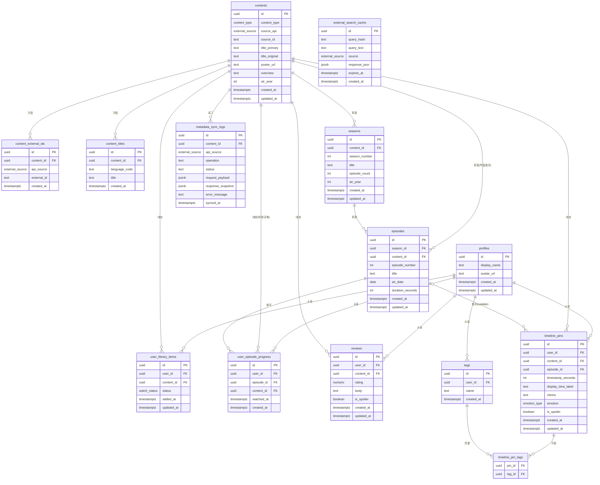

# SceneNote — ERD, RLS 정책, 인덱싱 전략

**버전:** 1.0.0
**작성일:** 2026-05-02
**작성자:** Supabase Backend Architect
**상태:** 확정 (MVP 기준)
**기반 문서:** 04_architecture.md

---

## 1. ERD (Entity Relationship Diagram)



---

## 2. 테이블별 RLS 정책 정의

### RLS 정책 원칙 요약

| 테이블 유형 | 대상 테이블 | SELECT | INSERT | UPDATE | DELETE |
|------------|------------|--------|--------|--------|--------|
| **사용자 기록** | profiles, user_library_items, user_episode_progress, reviews, timeline_pins, tags, timeline_pin_tags | 본인만 | 본인만 | 본인만 | 본인만 |
| **콘텐츠 메타데이터** | contents, content_external_ids, content_titles, seasons, episodes | authenticated | service_role만 | service_role만 | service_role만 |
| **검색 캐시** | external_search_cache | service_role만 | service_role만 | service_role만 | service_role만 |
| **시스템 로그** | metadata_sync_logs | service_role만 | service_role만 | service_role만 | service_role만 |

---

### 2.1 `profiles`

**목적:** Supabase Auth의 auth.users와 1:1 연결되는 사용자 프로필 테이블.

| 정책 | 조건 | 설명 |
|------|------|------|
| SELECT | `auth.uid() = id` | 본인 프로필만 조회 가능. 타 사용자 프로필 조회 불가 (MVP — 소셜 기능 없음) |
| INSERT | `auth.uid() = id` | 본인 프로필만 생성 가능. auth.users INSERT 트리거로 자동 생성 권장 |
| UPDATE | `auth.uid() = id` | 본인 프로필만 수정 가능 |
| DELETE | 허용 안 함 (또는 `auth.uid() = id`) | 계정 삭제는 Edge Function 또는 service_role을 통한 명시적 처리로만 허용 |

**보안 주의점:**
- `profiles.id`는 `auth.users.id`와 동일해야 한다. INSERT 시 `id` 값이 `auth.uid()`와 다른 경우를 차단하는 WITH CHECK 절이 필수다.
- MVP에서 다른 사용자의 프로필 조회는 불필요하다. Phase 3 소셜 기능 도입 시 `is_public` 컬럼 추가 후 SELECT 정책을 확장한다.

---

### 2.2 `contents`

**목적:** TMDB, AniList 등에서 가져온 콘텐츠 메타데이터. 여러 사용자가 공유하는 참조 데이터.

| 정책 | 조건 | 설명 |
|------|------|------|
| SELECT | `auth.role() = 'authenticated'` | 로그인한 모든 사용자 조회 가능. 검색 결과 표시 및 라이브러리 조회에 필요 |
| INSERT | **없음 (service_role만)** | 일반 사용자 직접 삽입 불가. add-to-library Edge Function이 service_role로 처리 |
| UPDATE | **없음 (service_role만)** | 메타데이터 갱신은 Edge Function만 수행 |
| DELETE | **없음 (service_role만)** | 콘텐츠 삭제는 service_role 명시적 작업으로만 허용 |

**보안 주의점:**
- INSERT/UPDATE/DELETE 정책을 아예 생성하지 않으면 `authenticated` 역할에서 해당 작업이 모두 차단된다. RLS 활성화 후 정책 없음 = 접근 차단 원칙을 활용한다.
- `service_role`은 RLS를 우회하므로 Edge Function에서만 사용하고, 클라이언트 코드에 서비스 키를 절대 포함하지 않는다.

---

### 2.3 `content_external_ids`

**목적:** 내부 content_id와 외부 API ID(TMDB ID, AniList ID 등) 간의 매핑 테이블.

| 정책 | 조건 | 설명 |
|------|------|------|
| SELECT | `auth.role() = 'authenticated'` | 검색 결과에서 이미 라이브러리에 있는 작품 판별에 사용. 모든 로그인 사용자 조회 허용 |
| INSERT | **없음 (service_role만)** | Edge Function(add-to-library)만 삽입 |
| UPDATE | **없음 (service_role만)** | |
| DELETE | **없음 (service_role만)** | |

**보안 주의점:**
- 클라이언트가 `(api_source, external_id)` 기준으로 라이브러리 중복 체크를 수행할 수 있어야 하므로 SELECT는 authenticated에 허용한다.

---

### 2.4 `content_titles`

**목적:** 콘텐츠의 다국어 제목 저장. Phase 1에서 스키마만 준비, Phase 2에서 활성화.

| 정책 | 조건 | 설명 |
|------|------|------|
| SELECT | `auth.role() = 'authenticated'` | 다국어 제목 조회 허용 |
| INSERT | **없음 (service_role만)** | |
| UPDATE | **없음 (service_role만)** | |
| DELETE | **없음 (service_role만)** | |

---

### 2.5 `seasons`

**목적:** 시리즈의 시즌 단위 메타데이터.

| 정책 | 조건 | 설명 |
|------|------|------|
| SELECT | `auth.role() = 'authenticated'` | 에피소드 선택 화면(SCR-009)에서 시즌 탭 표시에 필요 |
| INSERT | **없음 (service_role만)** | |
| UPDATE | **없음 (service_role만)** | |
| DELETE | **없음 (service_role만)** | |

---

### 2.6 `episodes`

**목적:** 에피소드 단위 메타데이터. fetch-episodes Edge Function이 lazy load 방식으로 저장.

| 정책 | 조건 | 설명 |
|------|------|------|
| SELECT | `auth.role() = 'authenticated'` | 에피소드 목록 표시, 핀 생성 시 에피소드 참조에 필요 |
| INSERT | **없음 (service_role만)** | |
| UPDATE | **없음 (service_role만)** | |
| DELETE | **없음 (service_role만)** | |

---

### 2.7 `user_library_items`

**목적:** 사용자의 감상 상태 및 라이브러리 항목.

| 정책 | 조건 | 설명 |
|------|------|------|
| SELECT | `auth.uid() = user_id` | 본인의 라이브러리만 조회 |
| INSERT | `auth.uid() = user_id` | 본인 명의로만 라이브러리 항목 생성. add-to-library Edge Function이 service_role로 처리 |
| UPDATE | `auth.uid() = user_id` | 감상 상태 변경 등 본인만 수정 |
| DELETE | `auth.uid() = user_id` | 라이브러리에서 제거 |

**보안 주의점:**
- `add-to-library` Edge Function은 service_role을 사용하므로 RLS를 우회하지만, `user_id`는 반드시 JWT에서 추출한 `auth.uid()`로 강제 설정해야 한다.
- 감상 상태 변경(`UPDATE`)은 클라이언트에서 직접 수행한다. RLS가 `user_id = auth.uid()` 조건을 보장한다.

---

### 2.8 `user_episode_progress`

**목적:** 에피소드 단위 시청 완료 상태 기록.

| 정책 | 조건 | 설명 |
|------|------|------|
| SELECT | `auth.uid() = user_id` | 본인의 시청 기록만 조회 |
| INSERT | `auth.uid() = user_id` | 에피소드 체크 시 본인 명의로만 생성 |
| UPDATE | `auth.uid() = user_id` | `watched_at` 갱신 등 |
| DELETE | `auth.uid() = user_id` | 에피소드 체크 해제 (또는 DELETE 대신 UPDATE로 처리) |

**보안 주의점:**
- 시청 기록은 민감한 개인 정보다. SELECT 정책에서 반드시 `user_id = auth.uid()` 조건을 유지한다.

---

### 2.9 `reviews`

**목적:** 작품에 대한 사용자 개인 평점 및 리뷰. MVP에서는 스키마만 준비, Phase 2에서 활성화.

| 정책 | 조건 | 설명 |
|------|------|------|
| SELECT | `auth.uid() = user_id` | MVP: 본인 리뷰만 조회. Phase 3에서 공개 리뷰 SELECT 정책 추가 |
| INSERT | `auth.uid() = user_id` | 본인 명의로만 리뷰 작성 |
| UPDATE | `auth.uid() = user_id` | 본인 리뷰만 수정 |
| DELETE | `auth.uid() = user_id` | 본인 리뷰만 삭제 |

---

### 2.10 `timeline_pins`

**목적:** SceneNote의 핵심 자산. 특정 에피소드/영화의 특정 시간에 남긴 기록.

| 정책 | 조건 | 설명 |
|------|------|------|
| SELECT | `auth.uid() = user_id` | 본인 핀만 조회. 스포일러 핀 포함 전체 조회 (블러는 클라이언트에서 처리) |
| INSERT | `auth.uid() = user_id` | 본인 명의로만 핀 생성. `user_id`를 `auth.uid()`로 강제 |
| UPDATE | `auth.uid() = user_id` | 본인 핀만 수정 |
| DELETE | `auth.uid() = user_id` | 본인 핀만 삭제 |

**보안 주의점:**
- 핀은 스포일러 내용을 포함할 수 있으므로 다른 사용자가 절대 조회해서는 안 된다.
- `episode_id`가 NULL인 영화 핀도 동일한 RLS 정책으로 보호된다.
- Phase 2에서 공개 핀 기능 도입 시 `is_public = true` 조건을 추가하는 별도 SELECT 정책을 추가한다 (기존 정책을 수정하지 않음).

---

### 2.11 `tags`

**목적:** 사용자가 생성한 개인 태그 목록.

| 정책 | 조건 | 설명 |
|------|------|------|
| SELECT | `auth.uid() = user_id` | 본인 태그만 조회. 태그 자동완성, 태그 목록 화면에 사용 |
| INSERT | `auth.uid() = user_id` | 본인 명의로만 태그 생성 |
| UPDATE | `auth.uid() = user_id` | 본인 태그만 수정 (Phase 2 태그 이름 변경) |
| DELETE | `auth.uid() = user_id` | 본인 태그만 삭제. CASCADE로 timeline_pin_tags도 삭제됨 |

---

### 2.12 `timeline_pin_tags`

**목적:** timeline_pins와 tags의 N:M 연결 테이블. `user_id` 컬럼이 없으므로 핀 소유자를 경유한 간접 정책 사용.

| 정책 | 조건 | 설명 |
|------|------|------|
| SELECT | 핀 소유자 경유 조회 | `EXISTS (SELECT 1 FROM timeline_pins WHERE id = pin_id AND user_id = auth.uid())` |
| INSERT | 핀 소유자 경유 검증 | 핀의 소유자가 현재 사용자일 때만 태그 연결 가능 |
| UPDATE | 핀 소유자 경유 검증 | |
| DELETE | 핀 소유자 경유 검증 | 핀 소유자만 태그 연결 해제 가능 |

**보안 주의점:**
- 이 테이블에 `user_id` 컬럼을 추가하는 것을 고려할 수 있으나, 중복 컬럼 관리 비용 및 불일치 위험이 있다. 핀 소유자 경유 방식이 더 안전하다.
- 간접 정책은 서브쿼리를 사용하므로 `timeline_pins(id, user_id)` 인덱스가 있어야 성능을 유지한다.

---

### 2.13 `external_search_cache`

**목적:** 외부 API 검색 결과 TTL 캐싱. 일반 사용자에게 내부 API 응답 구조가 노출되면 보안 위험이 있다.

| 정책 | 조건 | 설명 |
|------|------|------|
| SELECT | **없음 (service_role만)** | Edge Function 내부에서만 캐시 확인 |
| INSERT | **없음 (service_role만)** | Edge Function이 캐시 저장 |
| UPDATE | **없음 (service_role만)** | TTL 갱신 |
| DELETE | **없음 (service_role만)** | 만료 레코드 정리 |

**보안 주의점:**
- 모든 정책을 비워두면 RLS 활성화 시 authenticated 접근이 차단된다. 하지만 명시적으로 "service_role 전용 주석"을 남겨두는 것이 좋다.

---

### 2.14 `metadata_sync_logs`

**목적:** 콘텐츠 메타데이터 동기화 및 라이브러리 추가 작업의 감사 로그.

| 정책 | 조건 | 설명 |
|------|------|------|
| SELECT | **없음 (service_role만)** | 운영자/디버깅 용도. 일반 사용자 접근 불필요 |
| INSERT | **없음 (service_role만)** | Edge Function이 모든 동기화 작업 후 자동 기록 |
| UPDATE | **없음 (service_role만)** | 로그는 불변(immutable) 원칙 |
| DELETE | **없음 (service_role만)** | 보존 정책에 따라 배치로만 처리 |

---

## 3. 인덱싱 전략

### 3.1 인덱스 설계 원칙

- 인덱스는 **실제 조회 패턴**을 기준으로 설계한다.
- B-tree 인덱스: 등가(=), 범위(<, >), 정렬(ORDER BY) 최적화.
- Partial Index: 자주 쓰는 조건(`WHERE episode_id IS NULL`)에만 인덱스 범위를 좁혀 크기와 성능을 동시에 개선.
- GIN 인덱스: 전문 검색(Full-text search), JSONB 조회에 사용 (Phase 2).

---

### 3.2 `timeline_pins` 인덱스

#### IDX-01: 특정 사용자의 모든 핀 조회 (최근 순)

```
인덱스명: idx_timeline_pins_user_recent
SQL: CREATE INDEX idx_timeline_pins_user_recent
     ON timeline_pins (user_id, created_at DESC);
최적화 쿼리: My Page 통계, 태그별 핀 전체 목록 조회
쿼리 패턴: WHERE user_id = $uid ORDER BY created_at DESC
주의점: user_id 단독 조회도 이 인덱스의 leftmost prefix로 활용 가능
```

#### IDX-02: 특정 사용자의 특정 작품 핀 조회 (시간순)

```
인덱스명: idx_timeline_pins_user_content_ts
SQL: CREATE INDEX idx_timeline_pins_user_content_ts
     ON timeline_pins (user_id, content_id, timestamp_seconds ASC NULLS LAST);
최적화 쿼리: 작품 상세 → 전체 핀 목록(SCR-011, 작품 단위)
쿼리 패턴: WHERE user_id = $uid AND content_id = $cid
           ORDER BY timestamp_seconds ASC NULLS LAST, created_at ASC
주의점: timestamp_seconds의 NULL은 NULLS LAST로 목록 맨 뒤에 위치
```

#### IDX-03: 특정 사용자의 특정 에피소드 핀 조회 (시간순)

```
인덱스명: idx_timeline_pins_user_episode_ts
SQL: CREATE INDEX idx_timeline_pins_user_episode_ts
     ON timeline_pins (user_id, episode_id, timestamp_seconds ASC NULLS LAST);
최적화 쿼리: 에피소드 선택 → 해당 에피소드 핀 목록(SCR-011, 에피소드 단위)
쿼리 패턴: WHERE user_id = $uid AND episode_id = $eid
           ORDER BY timestamp_seconds ASC NULLS LAST, created_at ASC
주의점: 이 인덱스는 MVP에서 가장 빈번한 핀 조회 패턴. 반드시 생성.
        episode_id가 NULL인 영화 핀은 이 인덱스를 사용하지 않으므로 IDX-04 별도 필요.
```

#### IDX-04: 영화 핀 조회 (episode_id IS NULL) — Partial Index

```
인덱스명: idx_timeline_pins_movie
SQL: CREATE INDEX idx_timeline_pins_movie
     ON timeline_pins (user_id, content_id, timestamp_seconds ASC NULLS LAST)
     WHERE episode_id IS NULL;
최적화 쿼리: 영화 콘텐츠의 핀 목록 조회
쿼리 패턴: WHERE user_id = $uid AND content_id = $cid AND episode_id IS NULL
           ORDER BY timestamp_seconds ASC NULLS LAST, created_at ASC
주의점: Partial Index이므로 WHERE episode_id IS NULL 조건이 쿼리에 명시될 때만 사용됨.
        일반 인덱스보다 크기가 작고 선택도가 높아 성능 우수.
```

---

### 3.3 `timeline_pin_tags` 인덱스

#### IDX-05: 태그별 핀 조회

```
인덱스명: idx_timeline_pin_tags_tag_pin
SQL: CREATE INDEX idx_timeline_pin_tags_tag_pin
     ON timeline_pin_tags (tag_id, pin_id);
최적화 쿼리: 특정 태그가 달린 핀 목록 조회 (SCR-013, SCR-011 태그 필터)
쿼리 패턴: WHERE tag_id = $tag_id (JOIN timeline_pins)
주의점: 복합 PK (pin_id, tag_id)가 있으므로 (pin_id, tag_id) 방향은 자동 인덱싱.
        (tag_id, pin_id) 방향은 별도 인덱스가 필요. 태그별 핀 조회 성능에 결정적.
```

---

### 3.4 `user_library_items` 인덱스

#### IDX-06: 라이브러리 목록 — 상태 필터

```
인덱스명: idx_user_library_items_user_status
SQL: CREATE INDEX idx_user_library_items_user_status
     ON user_library_items (user_id, status);
최적화 쿼리: 라이브러리 탭 필터 (보는 중 / 완료 / 보고 싶음 / 전체)
쿼리 패턴: WHERE user_id = $uid AND status = 'watching'
주의점: user_id 단독 조회(전체 목록)도 leftmost prefix로 활용 가능
```

---

### 3.5 `user_episode_progress` 인덱스

#### IDX-07: 콘텐츠별 에피소드 진행률 조회

```
인덱스명: idx_user_episode_progress_user_content
SQL: CREATE INDEX idx_user_episode_progress_user_content
     ON user_episode_progress (user_id, content_id);
최적화 쿼리: 특정 작품의 전체 에피소드 진행률 조회 (SCR-009 시즌 진행률 표시)
쿼리 패턴: WHERE user_id = $uid AND content_id = $cid
주의점: UNIQUE (user_id, episode_id) 제약이 있어 (user_id, episode_id) 인덱스는 자동 생성.
        content_id 기준 조회를 위해 별도 인덱스 필요.
```

---

### 3.6 `external_search_cache` 인덱스

#### IDX-08: 검색 캐시 조회 (쿼리 해시 + 소스 + TTL)

```
인덱스명: idx_external_search_cache_lookup
SQL: CREATE INDEX idx_external_search_cache_lookup
     ON external_search_cache (query_hash, source, expires_at);
최적화 쿼리: Edge Function에서 캐시 hit 여부 확인
쿼리 패턴: WHERE query_hash = $hash AND source = $source AND expires_at > now()
주의점: expires_at 조건을 포함하면 만료된 레코드를 인덱스 레벨에서 조기 제거 가능.
        BRIN 인덱스 고려 가능 (created_at 기준 물리적 정렬 데이터에 유리) — Phase 2.
```

#### IDX-09: 캐시 TTL 만료 레코드 정리

```
인덱스명: idx_external_search_cache_expires
SQL: CREATE INDEX idx_external_search_cache_expires
     ON external_search_cache (expires_at);
최적화 쿼리: 만료된 캐시 레코드 배치 삭제 (Edge Function 또는 pg_cron)
쿼리 패턴: WHERE expires_at < now()
주의점: 캐시 테이블 크기 관리를 위한 정기 정리 쿼리에 활용.
        Supabase 무료 플랜에서는 pg_cron 사용 가능 여부 확인 필요. (확실하지 않음 — Uncertain)
```

---

### 3.7 `contents` 인덱스

#### IDX-10: 콘텐츠 UPSERT — source_api + source_id

```
인덱스명: (UNIQUE 제약으로 자동 생성)
SQL: UNIQUE (source_api, source_id) — 테이블 정의 시 포함
최적화 쿼리: add-to-library Edge Function의 contents UPSERT (ON CONFLICT 기준 컬럼)
주의점: UNIQUE 제약이 B-tree 인덱스를 자동 생성하므로 별도 CREATE INDEX 불필요.
```

---

### 3.8 인덱스 우선순위 정리 (MVP)

| 우선순위 | 인덱스 | 이유 |
|---------|--------|------|
| **P0** | IDX-03 (user_episode_ts) | 가장 빈번한 핀 조회 패턴 |
| **P0** | IDX-02 (user_content_ts) | 작품 단위 핀 목록 |
| **P0** | IDX-06 (user_library_status) | 라이브러리 메인 화면 |
| **P1** | IDX-05 (tag_pin) | 태그 필터링 기능 |
| **P1** | IDX-04 (movie partial) | 영화 핀 조회 |
| **P1** | IDX-07 (user_episode_progress) | 시즌 진행률 표시 |
| **P1** | IDX-01 (user_recent) | My Page 통계, 최근 핀 |
| **P2** | IDX-08 (cache_lookup) | 검색 캐시 성능 |
| **P2** | IDX-09 (cache_expires) | 캐시 정리 배치 |
